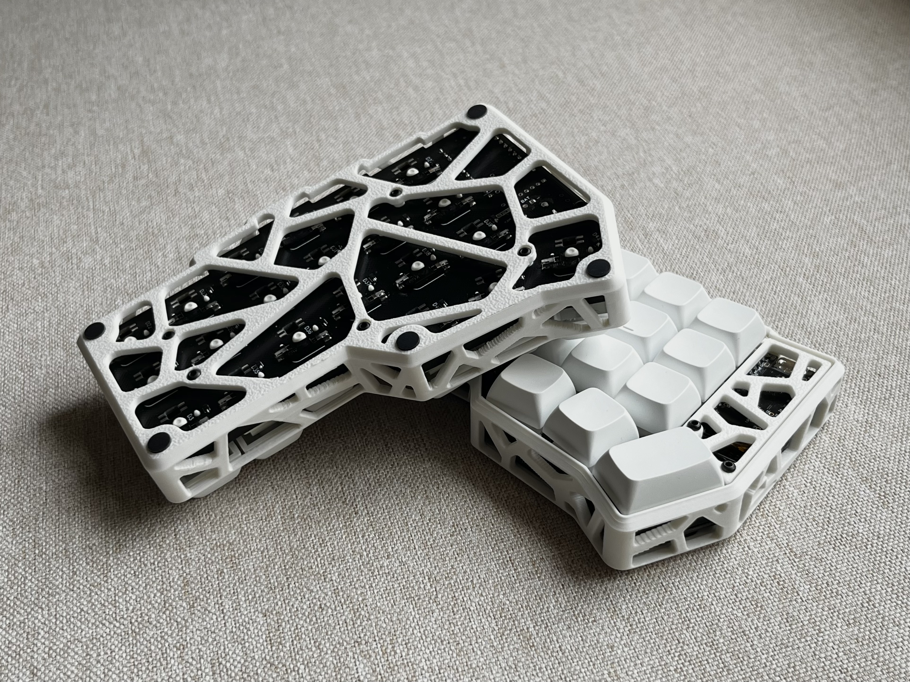
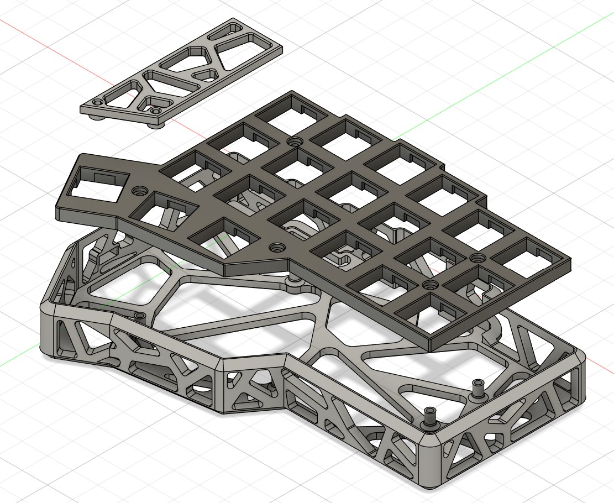
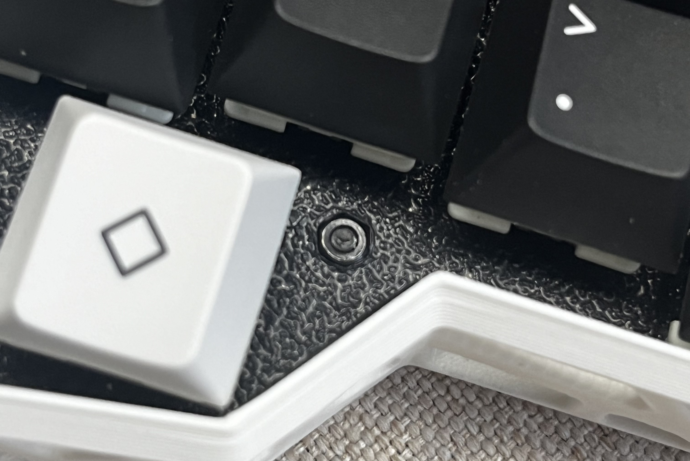

# Cornehole-case

**Models in this repo are made for ZMK corne with nice!nano and are only roughly tested to fit specific parts listed below.**

A case made for [corne(crkbd)](https://github.com/foostan/crkbd), with holes. 

Inspired by [KBDfans Holy60](https://kbdfans.com/products/holy60-case). 

### Parts: 

### 3D Printing: 

Tree support recommended for the case. 

### Hardware: 

<table>
<tr>
        <th>Part</th>
        <th>Count</th>
        <th>Note</th>
    </tr>
    <tr>
        <td>M2 x 10 Screws</td>
        <td>10</td>
        <td>For case assembly</td>
    </tr>
    <tr>
        <td>M2 Hex Nuts</td>
        <td>10</td>
        <td>For case assembly</td>
    </tr>
    <tr>
        <td>M2 x 4 Screws</td>
        <td>4</td>
        <td>For controller cover</td>
    </tr>
    <tr>
        <td>M2 x 8 screws</td>
        <td>4</td>
        <td>For controller cover</td>
    </tr>
    <tr>
        <td>M2 x 8 female to female standoffs</td>
        <td>4</td>
        <td>For controller cover</td>
    </tr>
    <tr>
        <td>6mm x 2mm flat top round bumpon</td>
        <td>10</td>
        <td>Feet</td>
    </tr>
    
</table>

### Notes: 
*There is no cutout for TRS/TRRS connector thus will need further modification to adapt for wired corne. The USB cutout also needs modification to fit the most recent corne v4 PCB with on board MCU. 

*Clearance on the bottom between the case and the PCB is only 1.7mm, thus SLS printed metal case could have shorting problems.  

*To use a normal 1.5mm/1.6mm corne plate instead of the 4.5mm 3D printed plate included in this repo, standoffs on the case need to be raised by 1.7mm and M2x10 screws need to be replaced by M2x12 screws. 

*The M2 nuts are meant to be embedded into the printed plate as shown below, by using a soldering iron with a pointy tip at 250C. 

